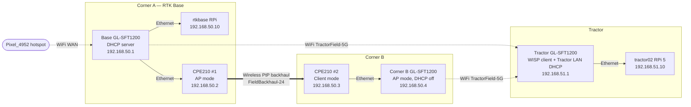

# Outdoor Field Network — CPE210 Point-to-Point Backhaul

**Project:** Autonomous Lawn Tractor  
**Status:** Planned implementation after arrival of two TP-Link CPE210 units  
**Purpose:** Extend the RTK-base local network from Corner A to Corner B across the field, while allowing the tractor to join local Wi-Fi near either corner.

---

## Solution overview (added 2026-07-03)

**Five physical network devices are needed**, not three — it's easy to undercount because two roles (the backhaul radios) are a different product from the rest:

| Device | Role | Hardware |
|---|---|---|
| Base router (Corner A) | Connects to `Pixel_4952`, DHCP server for the whole Field LAN, broadcasts `TractorField-5G` locally | GL-SFT1200 #1 |
| CPE210 #1 (Corner A) | Dedicated point-to-point backhaul radio, AP mode - talks only to CPE210 #2 | TP-Link CPE210 |
| CPE210 #2 (Corner B) | Dedicated point-to-point backhaul radio, Client mode - talks only to CPE210 #1 | TP-Link CPE210 |
| Corner B AP | Plugs into CPE210 #2's Ethernet output, broadcasts `TractorField-5G` locally at Corner B | GL-SFT1200 #2 |
| Tractor router | WISP/repeater client - joins whichever `TractorField-5G` signal is stronger, runs the Tractor LAN | GL-SFT1200 #3 |

**In one sentence:** the phone hotspot feeds the base router, which hands its network across the field to a second router at Corner B over a dedicated wireless CPE210 bridge (not the tractor's WiFi), and the tractor's own router roams between whichever of the two local `TractorField-5G` signals (Corner A's or Corner B's) is currently stronger.

**The point most worth remembering:** CPE210 #2 is not something the tractor can connect to directly - it's a bridge radio only, paired exclusively with CPE210 #1. Corner B needs its own separate AP (the third GL-SFT1200) sitting behind CPE210 #2 to actually give the tractor something to join.



---

## 1. Design goals

This design creates a **local Field LAN** that continues operating even when the Pixel phone has weak 5G coverage or disconnects. The phone hotspot is used only as an optional Internet/WAN uplink.

The field network will support:

- Delivery of RTCM corrections from the RTK base to the tractor.
- Tractor diagnostics, SSH, logging, and future telemetry.
- Future camera/video testing.
- A Wi-Fi access point at Corner B without running a buried Ethernet cable across the field.

This design does **not** make Wi-Fi the only safety system. Existing RC/manual override and hardwired ignition-grounding e-stop remain independent of this network.

---

## 2. Topology

```text
                                      Optional Internet only
                                      ----------------------
                                          Pixel_4952 hotspot
                                                  )))
                                                   \
                                                    \
Corner A — RTK base / main network                  Base GL-SFT1200 (router)
──────────────────────────────────────────────────────────────────────────────
RTK GNSS receiver ─ serial/USB ─ rtkbase RPi ─ Ethernet ─┐
                                                         │
                                                         ├── Base GL-SFT1200 LAN
                                                         │       192.168.50.1
                                                         │
                                                         └── CPE210 #1 PoE injector LAN port
                                                                  │
                                                         CPE210 #1 PoE port
                                                                  │
                                                        outdoor shielded Ethernet
                                                                  │
                                           CPE210 #1 — AP mode — 192.168.50.2
                                                     )))) FieldBackhaul-24 (((( 
                                           CPE210 #2 — Client mode — 192.168.50.3
                                                                  │
                                                        outdoor shielded Ethernet
                                                                  │
                                                         CPE210 #2 PoE injector LAN port
                                                                  │
Corner B — remote network                               Corner B AP LAN port
──────────────────────────────────────────────────────────────────────────────
Corner B Wi-Fi AP / router in AP mode
Management IP: 192.168.50.4
SSID: TractorField-5G
DHCP: OFF
NAT/router mode: OFF
                                                                  )))
                                                                   \
                                                                    \
Tractor                                                             Tractor GL-SFT1200
──────────────────────────────────────────────────────────────────────────────
Upstream Wi-Fi / repeater client: TractorField-5G
Field-side (WAN) address: DHCP reservation 192.168.50.100
Tractor-router LAN: 192.168.51.1/24
                                                                  │ Ethernet
                                                                  │
                                                        tractor02 RPi 5 eth0
                                                        192.168.51.10/24
                                                                  │
                                                        Existing GNSS / Teensy / services
```

### What the two CPE210s do

The CPE210 pair provides a dedicated **2.4 GHz point-to-point Ethernet bridge** between Corner A and Corner B. They are not the tractor's normal Wi-Fi access points.

- **CPE210 #1 at Corner A:** Access Point mode.
- **CPE210 #2 at Corner B:** Client mode.
- Together they behave like a wireless Ethernet cable.

Use AP + Client mode, not Bridge/Repeater mode. Keep both CPE210 radios dedicated to the backhaul only.

---

## 3. IP addressing plan

### 3.1 Field LAN — `192.168.50.0/24`

| Device | Role | Address | Address method | Gateway | Notes |
|---|---|---:|---|---:|---|
| Base GL-SFT1200 | Field LAN router and DHCP server | `192.168.50.1` | Static | N/A | Phone hotspot is WAN only. |
| CPE210 #1 | Corner A point-to-point AP | `192.168.50.2` | Static | `192.168.50.1` | DHCP disabled. |
| CPE210 #2 | Corner B point-to-point Client | `192.168.50.3` | Static | `192.168.50.1` | DHCP disabled. |
| Corner B AP | Corner B Wi-Fi access point | `192.168.50.4` | DHCP reservation preferred | `192.168.50.1` | AP mode only; DHCP off. |
| Future Corner A outdoor AP | Optional later upgrade | `192.168.50.5` | DHCP reservation | `192.168.50.1` | Add only if base-router Wi-Fi coverage is weak. |
| rtkbase Raspberry Pi | RTK correction server | `192.168.50.10` | Static or DHCP reservation | `192.168.50.1` | Existing correction service target. |
| Operator laptop/tablet | Field maintenance | `192.168.50.20` | DHCP reservation optional | `192.168.50.1` | Optional but convenient. |
| Tractor GL-SFT1200 Wi-Fi WAN | Tractor router's upstream address | `192.168.50.100` | DHCP reservation | `192.168.50.1` | Reserve by the tractor router's Wi-Fi/repeater MAC address. |
| Field DHCP pool | Temporary devices | `192.168.50.101–199` | DHCP | `192.168.50.1` | Keep `.2–.49` for infrastructure. |

**Mask for all Field LAN devices:** `255.255.255.0` (`/24`)

### 3.2 Tractor LAN — `192.168.51.0/24`

The tractor-side GL-SFT1200 stays in normal router/repeater (WISP) mode. It receives Wi-Fi on the Field LAN and creates a separate wired Tractor LAN for the RPi and any future onboard devices.

| Device | Role | Address | Address method | Gateway | Notes |
|---|---|---:|---|---:|---|
| Tractor GL-SFT1200 | Tractor LAN router | `192.168.51.1` | Static | N/A | Wi-Fi WAN side is `192.168.50.100`. |
| tractor02 RPi 5 | Tractor RPi | `192.168.51.10` | Static or DHCP reservation | `192.168.51.1` | Preferred Ethernet connection to tractor GL router. |
| Future Teensy Ethernet interface | Optional | `192.168.51.20` | Static/DHCP reservation | `192.168.51.1` | Not required for this phase. |
| Tractor LAN DHCP pool | Future devices | `192.168.51.100–149` | DHCP | `192.168.51.1` | Keep low addresses reserved. |

**Mask for all Tractor LAN devices:** `255.255.255.0` (`/24`)

### Why use two subnets?

The tractor GL-SFT1200 will join `TractorField-5G` as an upstream Wi-Fi client, then route the tractor's own Ethernet LAN through that link. This is the normal GL.iNet repeater/WISP design.

Consequences:

- The tractor RPi can initiate connections to the RTK base at `192.168.50.10`.
- The RTK base will usually see the connection as coming from the tractor GL router at `192.168.50.100`, not directly from `192.168.51.10`.
- A device at the base normally cannot directly initiate a connection to `192.168.51.10` without a tractor-side port-forward, VPN/tunnel, or a later bridge-mode redesign.
- This is acceptable for the first implementation because the tractor's RTCM client initiates and maintains its own connection to the base.
- **REVIEW NOTE (2026-07-03):** this limitation is already solved on this fleet - `tractor02` (and other units) already run ZeroTier for stable cross-network addressing. As long as this Field LAN's WAN uplink (the phone hotspot) reaches the real internet, `tractor02`'s ZeroTier IP stays reachable from anywhere regardless of the `192.168.50.x`/`192.168.51.x` addressing underneath it. No new tunnel/VPN work is needed for base→tractor SSH/diagnostics access - use the existing ZeroTier address for that, and reserve port-forwarding/tunneling only if something *other* than SSH/diagnostics (e.g. a service that must be initiated from the base specifically) turns out to need it.

---

## 4. Wi-Fi names and radio responsibilities

| Wireless network | Band | Purpose | Devices allowed |
|---|---|---|---|
| `FieldBackhaul-24` | 2.4 GHz | Dedicated CPE210 #1 ↔ CPE210 #2 backhaul | Only the two CPE210s |
| `TractorField-5G` | 5 GHz | Tractor, operator, future camera/video and normal field data | Tractor GL-SFT1200, laptop/tablet, approved clients |
| `Pixel_4952` | Phone Wi-Fi | Optional Internet/WAN for the base GL router | Base GL-SFT1200 only |

### Recommended radio rules

1. Keep the CPE210 pair dedicated to `FieldBackhaul-24`.
2. Use `TractorField-5G` as the tractor's primary Wi-Fi network.
3. Configure the Corner A and Corner B access points with the same `TractorField-5G` SSID, password, and security type.
4. Put the two local 5 GHz APs on different non-DFS channels when possible.
5. Use 40 MHz channel width initially for the local tractor Wi-Fi APs.
6. Use 20 MHz channel width initially for the dedicated 2.4 GHz CPE210 backhaul.
7. Do **not** lock the tractor GL-SFT1200 to one AP BSSID. It must be free to move between Corner A and Corner B APs.
8. If the Pixel hotspot allows a 5 GHz option, prefer it for the phone-to-base-router uplink so it does not compete directly with the 2.4 GHz CPE210 backhaul.
   - **REVIEW NOTE (2026-07-03) - this reasoning needs a second look:** the base router's hotspot-client connection and its `TractorField-5G` AP broadcast are the two roles competing for radio time here, not the hotspot vs. the CPE210 backhaul (those are already on separate physical hardware/cabling, so they don't compete at all). If the hotspot lands on 5 GHz, it's now sharing the *same* physical radio (phy1) as the `TractorField-5G` 5 GHz AP broadcast, which is the actual collision risk. Testing during the original single-hop WiFi-monitoring work (see `GLiNet_router_wifi_monitoring_setup_20260703.md`) confirmed `Pixel_4952` has changed bands unpredictably across different router boots (observed on 2.4 GHz ch6, 5 GHz ch48, and 2.4 GHz ch11 in three separate sessions) - so this can't be configured once and trusted; it needs to be checked after every reboot.
9. **NEW (2026-07-03):** before relying on rule 8, confirm via `iwinfo` on the base router (same technique documented in `GLiNet_router_wifi_monitoring_setup_20260703.md`) which band the hotspot actually associated on *this boot*, and which phy (phy0/phy1) is hosting `TractorField-5G`. If both end up sharing one phy, expect the base router to run concurrent AP+STA on that radio - this hardware has demonstrated it *can* do this (an AP and a client interface coexisted on the same phy in earlier testing), but concurrent AP+STA time-sharing on one radio chip typically costs some throughput/latency versus having them on separate physical radios. Not a hard blocker, but worth confirming empirically rather than assuming rule 8 alone prevents contention.

The tractor router—not the access points—ultimately decides when to roam. Same SSID/password supports basic roaming, but a short interruption during the switch remains possible.

---

## 5. Exact physical connections

### 5.1 Corner A — RTK base, main router, and CPE210 #1

```text
RTK GNSS receiver
        │ serial or USB
        ▼
rtkbase Raspberry Pi
        │ Ethernet
        ▼
Base GL-SFT1200 LAN port ──── CPE210 #1 passive-PoE injector LAN port
                                        │
                                        ▼
                          CPE210 #1 passive-PoE injector PoE port
                                        │
                                        ▼
                     Shielded outdoor-rated Cat5e/Cat6 cable
                                        │
                                        ▼
                              CPE210 #1 Ethernet port
```

Use the base GL-SFT1200 as the only DHCP server for the Field LAN.

If the base GL router does not have enough available LAN ports for both the `rtkbase` RPi and CPE210 #1 injector, add a small unmanaged Ethernet switch on the **LAN side** of the base GL router:

```text
Base GL-SFT1200 LAN
        │
        ▼
Small unmanaged Ethernet switch
   ├── rtkbase RPi eth0
   └── CPE210 #1 injector LAN port
```

The RTK receiver's serial/USB connection to the `rtkbase` RPi does not change. Only the `rtkbase` network connection changes or is standardized:

```text
RTK receiver → serial/USB → rtkbase RPi → Ethernet → Base GL Field LAN
```

### 5.2 Corner B — CPE210 #2 and remote access point

```text
CPE210 #2 Ethernet port
        │
        ▼
Shielded outdoor-rated Cat5e/Cat6 cable
        │
        ▼
CPE210 #2 passive-PoE injector PoE port
        │
        ▼
CPE210 #2 passive-PoE injector LAN port ──── Corner B AP **LAN** port
```

Important:

- Connect the Corner B AP to the CPE injector's **LAN** port.
- Do **not** connect it through the Corner B AP's WAN/Internet port.
- Configure the Corner B device in **Access Point mode**, not Router/WISP mode.
- Disable DHCP on the Corner B AP.
- Power the Corner B AP separately according to its own requirements. The CPE210 injector powers the CPE210 only.

### 5.3 Tractor

```text
Corner A or Corner B local AP
             ))) TractorField-5G (((
                       │
                       ▼
              Tractor GL-SFT1200
              Repeater/WISP client
                       │ LAN Ethernet
                       ▼
                tractor02 RPi 5 eth0
```

**Preferred tractor wiring:** connect the tractor GL-SFT1200 LAN port directly to the RPi 5's built-in `eth0` port. Keep the Teensy on USB serial for this phase.

Do not add a USB Ethernet adapter merely to improve Wi-Fi. USB Ethernet only creates a wired interface; it does not improve the radio link. The RPi 5 already has built-in Gigabit Ethernet.

---

## 6. Configuration sequence

Perform this in order. Do not mount the CPE210 units permanently until the point-to-point link and Corner B AP have been tested.

### Step 1 — Configure the Base GL-SFT1200

1. Connect a laptop to the base GL-SFT1200.
2. Change its LAN address from the GL.iNet default to:

   ```text
   Router LAN IP:  192.168.50.1
   Netmask:        255.255.255.0
   DHCP pool:      192.168.50.101 through 192.168.50.199
   ```

3. Configure the base GL router to join `Pixel_4952` as its Internet/repeater connection.
4. Configure the base router's local 5 GHz Wi-Fi as:

   ```text
   SSID:           TractorField-5G
   Security:       WPA2/WPA3 transitional only if all devices work reliably;
                   otherwise WPA2-PSK/AES with a strong unique password
   ```

5. Make a DHCP reservation for the Corner B AP at `192.168.50.4` once its MAC address is known.
6. Later, make a DHCP reservation for the tractor GL-SFT1200 Wi-Fi/repeater interface at `192.168.50.100`.

### Step 2 — Connect and configure `rtkbase`

Connect `rtkbase` by Ethernet to the base GL router or LAN-side switch.

Set the RPi address to:

```text
IP address:       192.168.50.10
Netmask:          255.255.255.0
Gateway:          192.168.50.1
DNS:              192.168.50.1, 1.1.1.1
```

Keep the existing correction service listening on:

```text
192.168.50.10:6001
```

Use an address reservation instead of a manually fixed RPi address if that is easier to manage. The important outcome is that the correction endpoint always remains `192.168.50.10:6001`.

### Step 3 — Configure CPE210 #1 at Corner A

Before joining it to the Field LAN, connect a laptop to the **LAN** side of the supplied CPE210 #1 passive-PoE injector.

If the unit is at factory defaults, temporarily set the laptop to an address such as:

```text
Laptop temporary address: 192.168.0.10
Netmask:                  255.255.255.0
```

Open the CPE management page at its factory-default management address, then configure:

```text
Name:               CPE210-A
Operation mode:     Access Point
Management IP:      192.168.50.2
Netmask:            255.255.255.0
Gateway:            192.168.50.1
DNS:                192.168.50.1 or 1.1.1.1
DHCP server:        Disabled
SSID:               FieldBackhaul-24
Band:               2.4 GHz
Channel width:      20 MHz
Channel:            Select 1, 6, or 11 after checking local interference
Security:           WPA2-PSK/AES with a long unique password
MAXtream:           Enabled
```

**REVIEW NOTE (2026-07-03):** `MAXtream` is TP-Link's TDMA scheme, mainly aimed at point-to-multipoint deployments with several CPEs contending for airtime. For a simple 2-node point-to-point link like this one, it's optional rather than required - fine to leave enabled since it shouldn't hurt, but if the backhaul link ever behaves oddly during testing, trying it both ways (enabled vs. disabled) is a cheap thing to rule in/out.

Label the actual device and its PoE injector: `CPE210-A — 192.168.50.2 — AP`.

### Step 4 — Configure CPE210 #2 at Corner B

Configure CPE210 #2 separately, also using a laptop attached to the **LAN** side of its injector.

```text
Name:                         CPE210-B
Operation mode:               Client
Management IP:                192.168.50.3
Netmask:                      255.255.255.0
Gateway:                      192.168.50.1
DNS:                          192.168.50.1 or 1.1.1.1
DHCP server:                  Disabled
Join SSID:                    FieldBackhaul-24
Lock to AP:                   Enabled — lock specifically to CPE210-A
Security/password:            Same as CPE210-A
Channel width:                20 MHz, matching CPE210-A
MAXtream Station Mode:        Auto Adjust initially
```

Label the actual device and its PoE injector: `CPE210-B — 192.168.50.3 — Client`.

### Step 5 — Configure the Corner B AP

The exact screens depend on the AP/router you buy. The required final state is:

```text
Mode:              Access Point / Bridge mode
Management IP:     192.168.50.4 via DHCP reservation
DHCP server:       Disabled
NAT/firewall:      Disabled or bypassed by AP mode
Uplink cable:      CPE210-B injector LAN port → Corner B AP LAN port
SSID:              TractorField-5G
Password:          Same as the Corner A local AP
Security:          Same as Corner A local AP
5 GHz channel:     Different from the Corner A local AP
```

Do not use the Corner B AP's WAN port. It must remain a simple bridge/access point on the same `192.168.50.0/24` network.

### Step 6 — Configure the tractor GL-SFT1200

The tractor GL router is **not** an access point for the field. It is a Wi-Fi client/repeater that joins the field APs.

Set its local Tractor LAN to:

```text
Tractor router LAN IP:  192.168.51.1
Netmask:               255.255.255.0
DHCP pool:             192.168.51.100 through 192.168.51.149
```

Then use the GL.iNet Repeater function to join:

```text
SSID:                  TractorField-5G
Password:              Same field Wi-Fi password
BSSID lock:            Disabled
```

At the base GL router, reserve the tractor router's Wi-Fi/repeater MAC address as:

```text
192.168.50.100
```

### Step 7 — Configure `tractor02` Ethernet

Connect the RPi 5 `eth0` port to a tractor GL-SFT1200 LAN port.

Recommended static settings:

```text
IP address:        192.168.51.10
Netmask:           255.255.255.0
Gateway:           192.168.51.1
DNS:               192.168.51.1, 1.1.1.1
```

For Ubuntu Netplan, a suitable starting file is:

```yaml
network:
  version: 2
  ethernets:
    eth0:
      addresses:
        - 192.168.51.10/24
      routes:
        - to: default
          via: 192.168.51.1
          metric: 100
      nameservers:
        addresses:
          - 192.168.51.1
          - 1.1.1.1
```

Apply only after saving a backup of the existing network configuration:

```bash
sudo cp -a /etc/netplan /etc/netplan.before-field-network
sudo netplan generate
sudo netplan apply
ip addr show eth0
ip route
```

During field testing, do not also have the RPi's `wlan0` connected to `TractorField-5G`. The RPi should reach the field network through its wired connection to the tractor GL router, which keeps roaming and routing under the tractor router's control.

---

## 7. RTK correction configuration

The existing `rtkbase` correction server should remain the correction source.

```text
RTK base correction server: 192.168.50.10:6001
Tractor RPi correction client: connects outbound to 192.168.50.10:6001
```

The tractor-side software should keep its existing reconnect behavior. When the tractor transitions between the Corner A and Corner B APs, a short disconnect may occur; the correction client must reconnect automatically.

The base firewall/service should allow the tractor router source address:

```text
Tractor router field-side address: 192.168.50.100
```

Do not configure the base to expect the source address `192.168.51.10`, because normal WISP routing hides the RPi behind the tractor GL router.

---

## 8. Installation and power notes

### CPE210 physical installation

- Mount CPE210 #1 and CPE210 #2 as high as practical, preferably about 8–12 feet above the nearby ground.
- Ensure their front faces point directly at each other.
- Start with clear line of sight and avoid mounting close to large metal objects.
- Use shielded outdoor-rated Cat5e or Cat6 cable with a ground wire.
- Ground the mast and install Ethernet surge protection according to the hardware instructions.
- Keep the passive-PoE injectors indoors or in weather-protected enclosures.
- Use the supplied/approved passive-PoE arrangement. Do not connect CPE210s directly to an ordinary 802.3af/at PoE source unless the power system explicitly supports the CPE's passive-PoE voltage and pinout.

### Corner B solar/battery requirements

Corner B must power both:

1. CPE210 #2 and its passive-PoE supply.
2. The Corner B local Wi-Fi AP/router.

The CPE210 and AP must have a continuously available, protected power source. Size the solar/battery system for the actual continuous load, conversion losses, winter conditions, and several days of poor sun—not only the nominal CPE rating.

---

## 9. Acceptance test plan

### 9.1 Bench test before field mounting

1. Configure both CPE210s.
2. Power both units and verify that CPE210 #2 joins `FieldBackhaul-24`.
3. From a laptop connected at Corner B, confirm DHCP is received from the base GL router.
4. Confirm these addresses respond:

```bash
ping -c 4 192.168.50.1   # Base router
ping -c 4 192.168.50.2   # CPE210-A
ping -c 4 192.168.50.3   # CPE210-B
ping -c 4 192.168.50.10  # RTK base RPi
```

5. Confirm the Corner B AP gives clients a `192.168.50.x` address, not a second private subnet.

### 9.2 RTK path test from the tractor RPi

From `tractor02`:

```bash
ping -c 4 192.168.51.1
ping -c 4 192.168.50.1
ping -c 4 192.168.50.10
nc -vz 192.168.50.10 6001
```

Expected behavior:

- `192.168.51.1` confirms the RPi reaches its tractor router.
- `192.168.50.1` confirms tractor-to-field routing works.
- `192.168.50.10` confirms the RPi reaches the RTK base.
- `nc` confirms that the correction server port is reachable.

### 9.3 Roaming test

Drive or carry the tractor slowly from Corner A toward Corner B while monitoring:

```text
Wi-Fi connection state
Wi-Fi RSSI/signal level
RTCM reconnects
RTCM age in seconds
GNSS fixed/float state
Ping loss to 192.168.50.10
```

The tractor router may temporarily hold onto a weakening AP before changing to the stronger AP. That behavior must be measured before relying on it for teleoperation.

### 9.4 Required safe behavior

The autonomous-control software must monitor the age of the last RTCM data received.

Recommended initial rule:

```text
If RTCM age exceeds the chosen threshold:
    pause or stop autonomous operation.
```

Also test this failure case:

```text
Corner B AP remains powered, but the CPE210 point-to-point link fails.
```

In that case, the tractor may associate with the strong Corner B AP but have no path to the RTK base. The tractor must recognize stale correction data and stop or safely pause rather than continue autonomously.

---

## 10. Expected limitations of the first version

- Same SSID/password at Corner A and Corner B enables basic roaming but does not guarantee seamless, controller-assisted roaming.
- The GL-SFT1200 is a compact travel router with internal antennas. It is acceptable for proof-of-concept testing but may become the weak tractor-side component.
- The base GL-SFT1200's own Wi-Fi may not provide ideal Corner A coverage if it is inside an enclosure or low to the ground. A later outdoor AP at Corner A is the expected upgrade if testing shows weakness there.
- The CPE210 backhaul has 100 Mbps Ethernet ports. This is ample for RTCM, telemetry, and initial video testing, but it is not equivalent to a gigabit wired backbone.
- Direct inbound access from the base to the tractor RPi is not expected in the initial WISP/NAT design. Use tractor-initiated connections, a tunnel/VPN, or explicit port forwarding when remote access is required.

---

## 11. Final configuration checklist

### Base / Corner A

- [ ] Base GL LAN is `192.168.50.1/24`.
- [ ] Base GL is the only Field LAN DHCP server.
- [ ] `rtkbase` is `192.168.50.10`.
- [ ] CPE210-A is AP mode at `192.168.50.2`.
- [ ] CPE210-A is connected to a base GL **LAN** port via its injector's **LAN** port.
- [ ] CPE210-A is aimed at Corner B.

### Corner B

- [ ] CPE210-B is Client mode at `192.168.50.3`.
- [ ] CPE210-B is locked to CPE210-A's `FieldBackhaul-24` SSID.
- [ ] CPE210-B's injector LAN port connects to Corner B AP **LAN** port.
- [ ] Corner B AP is in AP mode, with DHCP disabled.
- [ ] Corner B AP has/reserves `192.168.50.4`.
- [ ] Corner B AP broadcasts `TractorField-5G` using the same password/security as Corner A.

### Tractor

- [ ] Tractor GL router joins `TractorField-5G` as a repeater/WISP client.
- [ ] Tractor GL BSSID lock is disabled.
- [ ] Tractor GL has Field LAN DHCP reservation `192.168.50.100`.
- [ ] Tractor GL LAN is `192.168.51.1/24`.
- [ ] `tractor02` eth0 is `192.168.51.10/24` with gateway `192.168.51.1`.
- [ ] Tractor correction client targets `192.168.50.10:6001`.
- [ ] Stale-RTCM detection safely pauses/stops autonomous operation.

---

## 12. Troubleshooting quick reference

| Symptom | First checks |
|---|---|
| CPE210 #2 cannot see `FieldBackhaul-24` | Verify power, line of sight, pointing, same CPE210 band, CPE210-A AP mode, distance/height, and channel width. |
| CPEs connect but Corner B has no network | Confirm both CPEs use `192.168.50.0/24`, Corner B AP cable is in LAN—not WAN—and DHCP is disabled at Corner B. |
| Laptop at Corner B receives `192.168.8.x` or another subnet | Corner B device is routing/NATing; place it in AP mode and use LAN-to-LAN connection. |
| Tractor RPi cannot reach RTK base | Check RPi → `192.168.51.1`, then `192.168.50.1`, then `192.168.50.10`; check tractor GL Wi-Fi association and CPE bridge status. |
| RTK works near A but not near B | Check tractor roaming, Corner B AP uplink, CPE link status, and RTCM TCP reconnect logs. |
| Base laptop cannot SSH to `192.168.51.10` | Expected in the initial WISP/NAT design. Use a tractor-initiated connection, tunnel/VPN, or port forwarding. |
| Tractor appears connected to Corner B but RTCM is stale | Suspect Corner B AP is alive but CPE backhaul is down; autonomous mode must safely stop/pause. |

---

## 13. Decisions intentionally deferred

These are not required to bring up the first version:

- Adding a controller-managed AP ecosystem for better roaming.
- Replacing the tractor GL-SFT1200 with a vehicle-rated outdoor Wi-Fi client with external antennas.
- Adding a dedicated low-latency FPV video system.
- Moving RTCM from Wi-Fi to a separate 900 MHz serial telemetry radio.
- Using the Teensy 4.1 Ethernet interface for tractor networking.

Bring up, test, and log this two-CPE210 Wi-Fi design first. Make later upgrades based on measured roaming behavior, RTCM interruptions, video latency, and field coverage.

---

## 14. Reviewer notes (2026-07-03)

Overall assessment: this is a solid, well-scoped design. The AP/Client CPE210 pairing, the two-subnet separation, and especially the RTCM-staleness-triggers-autonomous-stop requirement in Section 9.4 are all sound engineering choices. Three things worth resolving before purchasing/building:

1. **Bill-of-materials ambiguity.** The doc refers to a "Base GL-SFT1200" and a "Tractor GL-SFT1200" as separate units, plus a not-yet-specified "Corner B AP." Confirm whether this plan assumes purchasing a *second* GL-SFT1200 (the fleet currently has one, already in use for tractor02's field connectivity), or whether the existing unit is being reassigned to one of these three roles while different hardware fills the others. This affects the total new-hardware count: 2× CPE210 + Corner B AP device, and possibly + a second GL-SFT1200.
2. **If a second GL-SFT1200 is purchased, reuse it deliberately rather than treating it as a blank slate.** All the operational quirks documented in `GLiNet_router_wifi_monitoring_setup_20260703.md` (Dropbear only offering `ssh-rsa`, `scp` needing `-O`, BusyBox `nc` being TCP-only with no `-u`/`-w`, client-mode interface names changing across reboots, the `chmod +x` inside a heredoc silently not taking effect) will very likely apply to a second unit of the same model too. Whichever device ends up as Corner B's AP, matching the existing GL-SFT1200 model means that doc's troubleshooting steps transfer directly instead of needing to be rediscovered on new hardware.
3. **Section 9.3's roaming test asks to monitor "Wi-Fi RSSI/signal level" but doesn't specify the capture mechanism.** The `wifi_publish.sh` script and its polling/caching pattern (also documented in `GLiNet_router_wifi_monitoring_setup_20260703.md`) were built for exactly this kind of measurement, but currently only cover the base router's hotspot link. Extending that same pattern - querying `iwinfo` for whichever CPE210 link stats are exposed, and piping into `field_test_logger`'s existing `router_wifi_ssid`/`router_wifi_rssi_dbm`/`router_wifi_signal_label` columns (scaffolded in `field_test_logger_20260703.py`) - would give the roaming test a logged, reviewable dataset instead of relying on live observation during the drive-test itself. Worth doing before Section 9.3, not after, so the first roaming test already produces usable data.

