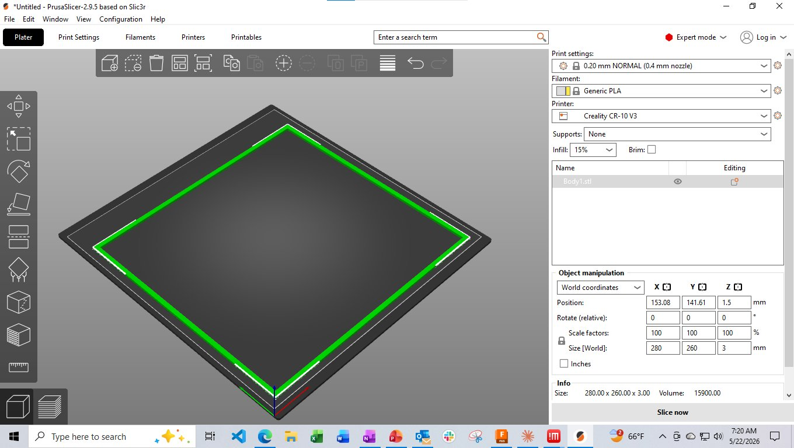

# 3D Printing Notes — Creality CR-10 v2

## Thread Sizing

- Model **M2.6** threads when the target fit is an **M2.5** standoff (verified by physical test print)

## CR-10 Maximum Print

The outline in the picture is 260x280. The CR-10 is limited to the area inside the paper clips that are holding the glass plate down. This might be able to be enlarged a little. Just pay attention to the first level printing. I also learned while printing this to adjust in real time the bed height. What I mean by is the very first layer was not going down the same in each corner. For the front two corners the nozzle was dragging on the glass. I quickly turned the adjustment wheel counter clockwise about 1/6 of a turn and the next layer I could see was being applied well. The first layer was not visible and the filament feeding wheel was jerking backward because the filament could not escape through the tube.
