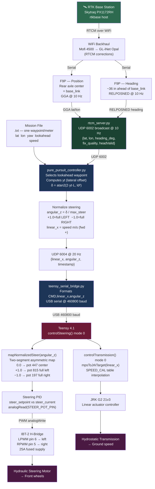

# Navigation Information Flow — tractor2025
*Last updated: 2026-07-14*

## Overview

End-to-end flow from RTK correction data to physical wheel movement in autonomous mode (mode 0).

---

## Flow Summary



---

## Step-by-Step Description

### 1. RTK Positioning (F9P → RPi, 10 Hz)

The base station transmits RTCM correction data over radio to the tractor's WiFi network.
On the tractor, `rtcm_server.py` receives corrections and forwards them over serial to both
F9P receivers.

- **Position F9P** — mounted over the rear axle center (= base_link). Computes lat/lon
  from GGA sentences. Because the antenna is at base_link, no position offset correction
  is needed.
- **Heading F9P** — mounted ~36 inches directly ahead of base_link. Computes the
  antenna-to-antenna vector via RELPOSNED, giving a compass heading.

`rtcm_server.py` fuses both into a single JSON message and broadcasts on **UDP 6002 @ 10 Hz**:

```json
{
  "lat": 40.48580267,
  "lon": -80.33227250,
  "heading_deg": 159.3,
  "fix_quality": "RTK Fixed",
  "headValid": true
}
```

RTCM corrections travel over WiFi: base station → Mofi 4500 field AP →
GL-iNet Opal router (onboard tractor) → serial to F9Ps.

---

### 2. Mission File

A pre-generated text file of densely-sampled waypoints, one per meter. Format per line:

```
lat  lon  yaw_rad  lookahead_m  speed_mps
```

- The first waypoint sets the local coordinate frame origin.
- `yaw_rad` — math-frame heading (CCW from east). Used only at the final waypoint for
  end-of-path steering; intermediate yaws are ignored.
- `lookahead_m` — pure pursuit lookahead distance at that waypoint (straight legs ~3 m,
  tight arcs ~1.5 m).
- `speed_mps` — commanded speed at that waypoint (straight legs 0.5 m/s, arcs 0.3 m/s).

---

### 3. Pure Pursuit Controller (`pure_pursuit_controller_20260714.py`, RPi)

Reads UDP 6002 each cycle. Converts lat/lon to local x/y meters via equirectangular
projection, transforms the selected lookahead waypoint into the vehicle frame, and
computes `yt` — the lateral offset (how far left or right the target is relative to
the tractor heading).

**Steering angle formula:**

$$\delta = \arctan\left(\frac{2 \cdot y_t \cdot L}{ld^2}\right)$$

where:
- `L` = wheelbase = 1.27 m
- `ld` = lookahead distance from the mission file
- `yt` = lateral offset of the lookahead point in the vehicle frame

This is the textbook pure pursuit formula `δ = atan(2L·sin(α)/ld)` with
`yt = ld·sin(α)` substituted, where `α` is the heading error angle. The explicit
angle is never computed; `yt` carries the same information.

**Lookahead point selection:** the first waypoint in the mission file that is farther
than `ld` from the tractor's current position. It advances along the waypoint list
each cycle as the tractor moves forward.

---

### 4. Steering Normalization and Speed

`δ` is normalized to **−1.0 … +1.0** relative to `max_steer` (0.623 rad, derived
from measured turning geometry):

| Value | Meaning |
|-------|---------|
| `+1.0` | Full LEFT lock |
| `0.0` | Center / straight |
| `−1.0` | Full RIGHT lock |

Speed from the mission file passes through as `linear_x` in m/s (positive = forward),
safety-capped at **1.5 m/s**.

Both are sent as JSON on **UDP 6004 @ 20 Hz**:

```json
{"linear_x": 0.5, "angular_z": -0.375, "timestamp": 1752537600.0}
```

---

### 5. Teensy Serial Bridge (`teensy_serial_bridge.py`, RPi)

Subscribes to UDP 6004, formats each message as a serial command string, and writes
to the Teensy 4.1 over USB:

```
CMD,0.5,-0.375\n
```

- **Baud rate:** 460800
- **Dead-man switch:** the Teensy firmware has a 500 ms `cmd_vel` timeout. If messages
  stop arriving (RPi crash, bridge restart, network dropout), the Teensy returns to
  neutral automatically.

---

### 6. Low-Level Steering (`controlSteering()`, Teensy 4.1, mode 0 = Auto)

`mapNormalizedSteer(angular_z)` converts the normalized command to a physical pot
setpoint using a **two-segment asymmetric linear map** that reflects the tractor's
actual steering geometry:

| `angular_z` | Pot setpoint | Direction |
|-------------|-------------|-----------|
| `+1.0` | 815 | Full LEFT (368 counts from center) |
| `0.0` | 447 | Center |
| `−1.0` | 197 | Full RIGHT (250 counts from center) |

The asymmetry (368 counts left vs. 250 counts right) reflects unequal mechanical
travel each side of center.

---

### 7. Steering PID → IBT-2 → Steering Motor

`steer_setpoint` (desired) and `steer_current` (actual, from `analogRead(STEER_POT_PIN)`)
feed a PID controller. The output becomes a PWM value:

- **Positive error** (pot needs to increase → steer LEFT) → `analogWrite(LPWM_Output, pwm)` (Teensy pin 6)
- **Negative error** (pot needs to decrease → steer RIGHT) → `analogWrite(RPWM_Output, pwm)` (Teensy pin 5)

The IBT-2 H-bridge sources current from the 25A fused battery supply and drives the
hydraulic steering motor until the pot reaches setpoint.

---

### 8. Speed Control (`controlTransmission()`, Teensy 4.1, mode 0 = Auto)

`mpsToJrkTarget(linear_x)` interpolates a field-calibrated speed table (`SPEED_CAL`)
to produce a continuous JRK G2 21v3 target position. The JRK drives the hydrostatic
transmission linear actuator to the corresponding position, setting ground speed.

> ⚠️ `SPEED_CAL` currently holds placeholder anchors (0 m/s = 2836, 1.5 m/s = 2288,
> linear). Replace with measured pairs from speed calibration field test.

---

## Mode Switch Reference

| Switch position | Mode | Number | Behaviour |
|----------------|------|--------|-----------|
| DOWN | Auto | 0 | RPi `cmd_vel` commands active |
| MIDDLE | Manual | 1 | RC joystick controls steering and transmission |
| UP | Pause | 2 | Neutral — all motors stopped |
| (radio lost) | No signal | 9 | Firmware safety — neutral, motors off |

---

## Key Constants (tractor01)

| Parameter | Value | Notes |
|-----------|-------|-------|
| Wheelbase `L` | 1.27 m | |
| `max_steer` | 0.623 rad (~35.7°) | Derived from turning circle; pending field verification |
| Pot center | 447 counts | Bench-measured |
| Pot full left | 815 counts | Bench-measured |
| Pot full right | 197 counts | Bench-measured |
| Speed cap | 1.5 m/s | Software limit; SPEED_CAL calibration pending |
| GPS update rate | 10 Hz | rtcm_server UDP 6002 |
| cmd_vel rate | 20 Hz | UDP 6004 |
| Serial baud | 460800 | RPi USB → Teensy |
| cmd_vel timeout | 500 ms | Firmware dead-man switch |

---

## Related Files

| File | Location | Purpose |
|------|----------|---------|
| `rtcm_server_20260702.py` | `tractor_rpi/` | F9P fusion → UDP 6002 |
| `pure_pursuit_controller_20260714.py` | `tractor_rpi/pure-pursuit/` | Navigation controller |
| `teensy_serial_bridge_20260709.py` | `tractor_rpi/` | UDP 6004 → serial bridge |
| `teensy_main_20260714.cpp` | `tractor_teensy/src/` | Teensy firmware |
| `mission_out_and_back_20260713.txt` | `tractor_rpi/pure-pursuit/` | Test mission file |
| `make_mission_20260713.py` | `tractor_rpi/pure-pursuit/` | Mission generator |
