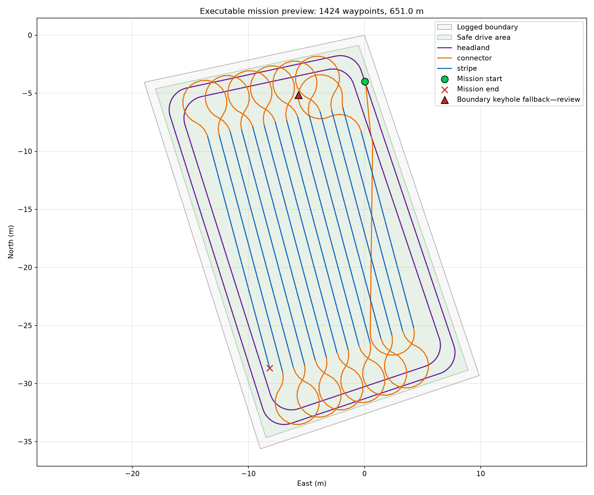
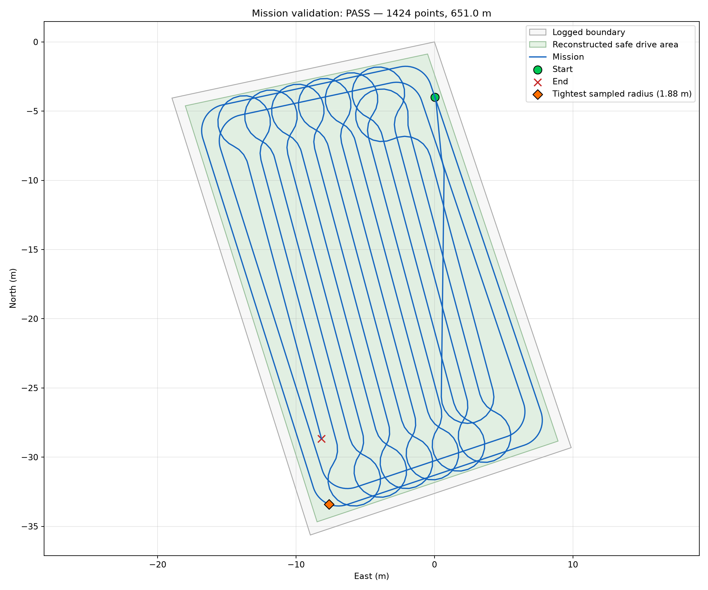

# 62 Collins Dr Coverage Mission

**Status: static validation PASS — not yet field approved**

The executable controller file is `62_Collins_Dr_mission.txt`. It contains:

```text
lat lon yaw_rad lookahead_m speed_mps
```

## Mission summary

| Item | Value |
|---|---:|
| Coverage angle | 105.0° math frame |
| Compass stripe headings | 345.0° / 165.0° |
| Lane spacing | 0.9906 m (39.0 in) |
| Planning turn radius | 1.90 m |
| Turn policy | keyhole |
| Waypoints | 1,424 |
| Route length | 651.0 m |
| Maximum waypoint gap | 0.50 m |
| Minimum validated sampled radius | 1.88 m |
| Boundary keyhole fallbacks | 1 |
| Static validation | PASS |

## Versioned files

| File | Purpose |
|---|---|
| `62_Collins_Dr_mission.txt` | Executable Pure Pursuit mission |
| `run_62_Collins_Dr_mission.sh` | RPi launcher for logger plus controller |
| `01_boundary_final.csv` | Reviewed final site polygon |
| `02_plan_settings.json` | Exact planner inputs |
| `02_coverage_segments.csv` | Reviewed coverage rows and execution order |
| `62_Collins_Dr_mission_audit.csv` | Waypoint geometry and controller parameters |
| `62_Collins_Dr_mission_build_report.json` | Connector decisions and build provenance |
| `62_Collins_Dr_mission_validation.json` | Independent static validation results |
| `62_Collins_Dr_mission_preview.png` | Visual mission checkpoint |
| `62_Collins_Dr_mission_validation.png` | Visual validation checkpoint |

The settings and reports retain their original planning-machine paths as
provenance. The executable mission itself has no path dependency.

## Integrity

SHA-256 for `62_Collins_Dr_mission.txt`:

```text
C67B5E2BE6CA06B3F47C2DABB9AD0EA0FC5AFDCCB0FF72CFB13C56446A92320A
```

## Visual checkpoints





## Field hold point

Static `PASS` confirms file structure, containment, waypoint spacing, yaw,
speed, and sampled curvature. It does not confirm map accuracy, terrain,
mower-deck clearance, controller tracking, or obstacle clearance.

Before normal operation:

1. Pull this exact Git revision onto the tractor RPi.
2. Confirm the mission SHA-256.
3. Perform a controller-load/no-motion check.
4. Review every boundary keyhole fallback.
5. Conduct a supervised low-speed test with RTK Fixed and immediate e-stop
   access.

Initial RPi launch from this directory:

```bash
bash ./run_62_Collins_Dr_mission.sh
```

The launcher caps controller speed at 0.75 m/s. A
different explicitly approved cap can be supplied with `--max-speed`, for
example:

```bash
bash ./run_62_Collins_Dr_mission.sh --max-speed 0.75
```

This directory contains exact geographic coordinates. Do not publish it in a
public repository unless that disclosure is intentional.
